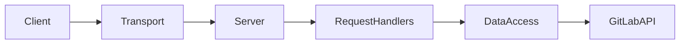

# System Patterns: GitLab MCP Server

## Architecture

The server follows a standard Model-Context-Protocol server architecture:

- **Server:** The core server implementation using the `@modelcontextprotocol/sdk`.
- **Transport:** Uses `StdioServerTransport` for communication with the client (VS Code extension).
- **Request Handlers:** Handles incoming requests (ListTools, CallTool) and dispatches them to appropriate functions.
- **Data Access:** Uses `axios` to interact with the GitLab API.
- **Error Handling:** Implements error handling to catch and report API errors and other exceptions.
- **Tool Definitions:** Defines tools with names, descriptions and input schemas.

## Key Technical Decisions

- **TypeScript:** Chosen for type safety and maintainability.
- **Axios:** Used for making HTTP requests to the GitLab API due to its simplicity and promise-based nature.
- **Environment Variables:** Used to store sensitive information like the API token.
- **JSON Schema:** Used to define the input schema for tools.

## Design Patterns

- **Dependency Injection:** The `axios` instance is created in the constructor and used throughout the class.
- **Strategy Pattern:** The `CallToolRequestSchema` handler uses a switch statement to select the appropriate function based on the tool name. This is a simple form of the strategy pattern.

## Component Relationships

